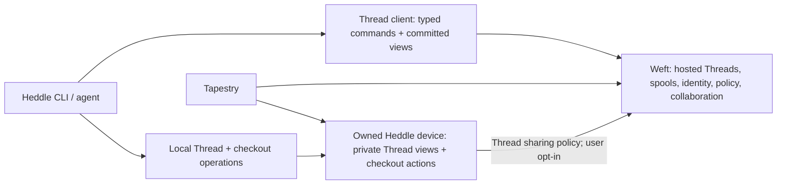

# Heddle Thread API

This executable design starts from Heddle main `2a67bcaf` (the merged #1718
local-operations cutover). It exercises native v2 calls over real Iroh streams
and uses the resulting call sites to test the API design.

The public `heddle-thread-api` crate lives in Heddle's main workspace. It contains
native v2 transport, committed observations, ordinary Biscuit authorization,
and continuous replication backed by the native Thread store. The production
CLI still uses `crates/hosted-client`; its command adapters
and hosted Weft routing have not completed their v2 cutover.

The owner-capability verifier and ordinary Biscuit verifier are public leaf
crates next to this crate. Neither depends on repository or transport code.
Browser consumers can build the owner verifier directly as WASM.

## Choose the implementation dependencies

The client, committed observations, content reads, credential interface, and
typed errors are transport-neutral. Consumers can disable default features to
use them without repository storage, Tokio, or an Iroh implementation:

```toml
heddle-thread-api = { version = "0.21.0", default-features = false }
```

| Features | Additional implementation |
| --- | --- |
| None | Typed client and committed observations over a caller-provided transport |
| `iroh` | Iroh connection adapter and cancellation-safe stream framing |
| `signing` | Public, bearer-only and Ed25519 request credentials without local storage |
| `replication` | Async causal exchange and stream driver over a caller-provided durable store |
| `native` | Replication with a SQLite/object-store adapter, local change feed, and host Biscuit authorization |
| `native` + `iroh` (default) | Native replication RPC over Iroh, plus the client above |
| `semantic-analysis` | Shared Rust conditional-value extraction/projection for hosts; optional and not part of client defaults |

## Semantic review data

`remote.observe_analysis(request, resume)` delivers committed typed analysis
batches with page information through the same checkpoint implementation as
Thread views. It supports behavior maps, coverage, replacements and removals;
FIN without Complete remains an interrupted observation. The request pins base
and source revisions and selects paths/symbols. Rendering and optional summaries
belong to the caller, not the parser or transport.

With `semantic-analysis`, `behavior::BehaviorAnalyzer::new(base, source)?.compare`
projects exact source bytes into the same v2 records for local or hosted use.
`heddle-semantic::behavior::compare_file` owns extraction and correspondence,
reusing the existing parsed-file cache, symbol visitor, token normalization and
lexical scope index. No parser enters a portable client build.

The first slice supports field initializers and assignments introducing or
changing Rust `if/else` values. It preserves one old origin shared by branch
comparisons, exact source references, predicate binding dependencies, explicit
ambiguity and omitted scope. It emits structural facts, not inferred effects or
test approval. The full #1718 capture source pair is checked in as a navigation
fixture. The device daemon's analysis RPC is not yet wired; the shared projection
is available to its embedding host. Full diffs and file inventories remain
independent surfaces.

Weft enables `replication`, implements `ReplicaStore` with PostgreSQL, and supplies
the stream traits using its own transport stack. It shares the causal protocol
without importing local checkout storage or Heddle's Iroh version. The host
provides one `Feed::from_changes` watcher per Thread; notification loss prompts
durable frontier reconciliation. Heddle's normal configuration enables `native`
and `iroh`. Fixtures and examples
require `iroh`; the native replication integration requires both. CI checks the
dependency boundaries and tests every combination, so a default workspace build
cannot hide an accidental dependency between the two features. The core also
compiles for `wasm32-unknown-unknown`; a browser transport adapter remains the
consumer's responsibility.

`credentials::Credentials` accepts a public caller, a bearer-only credential,
or a caller-owned Ed25519 signer with raw Biscuit bytes and an optional grant
envelope. Request identity derives from the signing key; a mutable handle is
never an independent signing input. Each retry keeps its operation ID and gets
a fresh nonce. The returned context binds the operation even when used by a
transport other than Iroh. This requires only the `signing` feature; host-side
Biscuit verification and durable nonce consumption remain under `native`.

The Iroh adapter counts application bytes at each successful stream read/write,
including framing, remote failures, and partial reads or writes before cancellation.
`HEDDLE_PROFILE=1` enables the shared `heddle-perf-contract` counters. Endpoint
initialization remains the connecting application's responsibility; constructing
another RPC adapter does not imply another connection. CI runs the counter
contract on a real Iroh connection with three unary calls and an observation.

## Live native replication

`live_replication::run` asks the host for an `ActivityGuard` before each store
step and disclosure check. `Activity::Check` needs no output-memory reservation;
`Activity::Receive` uses the input memory already accounted for by the reader,
and advances bounded control queues without waiting for producer memory.
`Activity::Work` may produce a bounded frame. `finish(encoded_bytes)` releases
work slots and unused memory, returning the lease retained through delivery. Idle waits hold neither.
A device can keep returning `()`; a hosted scheduler can queue work separately
from its idle subscription allowance. Cancellation releases both leases.

Prepare `creation::ThreadCreation::sign(operation_id, &genesis, &signer)` once
and persist its original signed record for retries. The genesis uses the spool's
stable UUID, including for private local work; a later rename or publication
does not change Thread identity. `remote.start_thread(&creation)` returns the
mutation receipt and resulting overview in one call. Bind later operations with
`remote.thread(creation.reference().clone())` without a lookup. `from_signed`
relays an existing creator's record without replacing its signature. First
replication accepts that same record. The SDK rejects responses for a different
operation, endpoint or Thread, and an applied response missing its overview.

The checked-in genesis vector is shared with the API TypeScript tests. It
covers canonical bytes, typed BLAKE3 identity, Ed25519 signature and protobuf
relay; browser-side canonical construction remains separate.

`replication_rpc::Peer` opens one `SyncService.ReplicateThread` exchange for a
Thread. `ThreadReplica::create` requires and retains the original signed
creation record. `ThreadReplica::open` reopens by Thread ID without a signing
key and never creates storage. `Peer::new` loads this durable proof automatically;
an authorized receiver can create the same replica in the first opening. The creator's signature
and canonical hash remain unchanged when another authorized device relays it.
`live_replication::Feed` is shared across streams for that Thread;
it detects writes from other processes through the durable database generation.
Source and discussion operations have separate causal graphs and sharing facets.
Each destination remains private by default until its Thread sharing policy opts
in. Adding or revoking that policy takes effect on an already open stream.

```rust,ignore
let feed = Feed::new(replica.clone()).await?; // share with this Thread's streams
let peer = Peer::new(replica, local_endpoint, authorized_facets)?;
peer.connect(connection, EndpointKind::Weft, credential, store, &feed,
    recheck_local_permission).await?;
```

The accepting host supplies its resolved `RootAuthority`; the opening proves
possession of the Biscuit-bound key and signs the Thread, facets, and both Iroh
identities. Durable nonce claims prevent replay across restart. Root attachment
changes and token checks are reevaluated throughout the exchange. This adapter
assumes the host has already resolved the correct owner/account and spool. It
does not replace Weft's grant registry, account attachment, or revocation checks.

Admission receipts distinguish accepted, missing-parent pending, and rejected
records. Peer frontiers and receipts persist, while each session keeps a bounded
dependency-request window. Reopening repairs interrupted and out-of-order
delivery. An accepted record is metadata with accepted causal closure; it does
not assert that all referenced source blobs have been downloaded.

`ThreadCheckout` uses native captures and a checkout-local writer lease. Separate
checkouts can capture the same Thread concurrently. Their source heads remain
concurrent until explicit integration, and receiving metadata never changes a
checkout's HEAD. A retried capture returns its original durable receipt without
rewinding later work.

The native Iroh integration test verifies writes made after opening, ongoing
opt-in, live root detachment, and reconnect repair. State-machine tests exercise
reordered ancestry through a two-item window, durable acceptance, and writes
that sort behind a frontier cursor while it is being paged. Those are separate
from the fixture-based observation/content examples below.

## Try the client

From the Heddle workspace root:

```sh
cargo run --locked -p heddle-thread-api --example thread
cargo test --locked -p heddle-thread-api
cargo run --locked -p heddle-thread-api --example multiplex -- 1024
```

Both examples start a loopback contract peer. They need local UDP socket access;
they need no account, credentials, relay, or running Weft. The peer generates an
ephemeral fixture signing key and verifies signatures over each exact request.
It supplies fixture Thread/content records. It does not verify Biscuits or root
attachments, authorize real resources, or publish durable data.

The API dependency is pinned to the companion API PR. **Merge API #222 first.**
The live-sync follow-up also depends on the companion API replication contract.
Update its immutable dependency pin to the merged revision or release before landing.

## The call sites

```rust,ignore
let thread = remote.thread(saved_thread_ref); // local binding; zero RPCs
let mut view = thread.observe(
    &[ThreadSection::Overview, ThreadSection::Review, ThreadSection::Collaboration],
    ObservationMode::Follow,
    saved_checkpoint,
).await?;

while let Some(batch) = view.next_commit().await? {
    // One transaction: apply batch.changes and persist batch.resume.encode().
    // batch.replace distinguishes a replacement snapshot from committed deltas.
}
```

Editing intent uses the bound Thread and the version already observed:

```rust,ignore
let response = thread.revise_intent(operation_id, &observed_intent, proposed).await?;
```

The caller retains the operation ID across an intentional retry. Transport
failure does not silently repeat a write. Applied, blocked and pending receipts
remain typed outcomes. Capability discovery checks actual advertised handlers.
The generated `remote.api` client exposes every other typed v2 RPC without
maintaining a handwritten route list in Heddle.

Content has its own demand-driven read, pinned to the observed revision:

```rust,ignore
let blobs = remote.read_blobs(observed_tip, vec![
    BlobSource::Path("README.md".into()),
    BlobSource::ObjectHash(missing_blob_hash),
]).await?;
```

This bounded convenience method reads complete blobs into memory. Large files
and packs use the underlying typed streams with ranges and caller-owned sinks.
The helper checks chunk identity, contiguous ranges, total size, exact revision,
budgets and explicit selection completion. Installing blobs into Heddle's object
store still requires its canonical object-codec hash verification.

## What changed in the contract

The client exercise has already changed API #222:

1. `BlobRead` selects a path **or a native blob hash**. Heddle's hydrator should
   not need to discover a path or fetch a pack to retrieve one missing object.
   The endpoint must authorize the pinned revision and prove the object is
   reachable from it. A hash is never an authorization token.
2. Generated v2 descriptors expose operation-ID extraction. The Iroh adapter
   gets context metadata from the actual encoded request and descriptor instead
   of keeping another route/field-number catalog.
3. Typed observations have explicit cancellation, including after a terminal
   control. Dropping a reader cancels receiving; finishing a transfer's input
   keeps its response stream alive.

## Boundaries that fit the client

| Concern | Main's hosted client | Candidate v2 client |
|---|---|---|
| Thread addressing | Paginated name lookup before ID-addressed operations | Bind a persisted stable `ThreadRef` locally |
| Thread view | Separate resource calls and event hydration | One selected, checkpointed observation |
| Content | Path read or scoped pull during lazy hydration | Batched path/hash reads at an exact revision |
| RPC dispatch | Handwritten wrappers and route strings | Generated typed methods over one adapter |
| Reconnection | Resource-specific subscription plumbing | Persist view and checkpoint together; explicitly resume |
| Writes | Client-specific request preparation | Observed versions, stable operation ID, typed receipt |



An endpoint is one source of the combined Thread. Its source heads/version/checkouts must
remain source-qualified; arrival order cannot make a device overwrite hosted
state. Hosted review and landing target Weft directly. Capture, resolve and local
landing target an explicit checkout on its owning device. `Authorize` is the
seam for Heddle's existing signer/broker and the user's root-attached credentials;
it does not ask Weft to mint device or browser authority.

## What the exercise says about DX and AX

Keep the command vocabulary around local work and Threads. Move common Thread
selection into one resolver, then have `show`, `log`, `review` and `sync` consume
that selected Thread. A command should not re-resolve its display name for each
piece of evidence. Live output should apply committed changes from the same view
used by a one-shot command. JSON output needs explicit source, coverage,
requirements and operation outcomes so an agent never guesses from missing data.

The durable Thread identity should be a distinct field from #1718's validated
local name. Local names remain useful CLI selectors. Renaming a Thread or editing
its intent must not change the immutable genesis hash. Both local creation and
API creation need the same canonical genesis format before either ships.

The stream lifecycle and bookmark plumbing demonstrated here belongs in a shared
SDK once the shape is accepted. Heddle and Tapestry should share those semantics.
The remaining view reducer must validate typed record keys and apply section
replacement/removal semantics; this client currently returns committed
typed changes rather than claiming it has materialized every Thread section.

Finishing the actual CLI cutover also requires adapting existing local Thread selectors,
the object-store hydrator, publication/fetch installation, and all current hosted
command callers. The canonical genesis hash and durable native operation format
are implemented; signed unknown-Thread creation and source-pack installation
remain. The native replication RPC currently accepts already resolved Threads.
Portable root attachment verification and multi-device
writer handoff remain separate implementation/design work. The old API service
schemas and production hosted-client code must be removed as part of that full
cutover; this client does not mark that work complete.

The discussion/context assessment and proposed next agent-facing work are in
[the design note](../../docs/THREAD_AGENT_EXPERIENCE.md).

## Evidence

The integration tests use real loopback Iroh connections. They cover committed
snapshot/edit/live update, a persisted resume checkpoint, path/hash batching,
wrong revision, interrupted view/content, bounded frames/batches, reset, local
rejection of mismatched bookmarks and unimplemented methods. Transport tests
cover cancellation after a partial header, bidirectional progress before request
FIN, responses after request half-close, and preservation of typed error details.

The multiplex probe held **1,024 simultaneous observations on one connection**,
then verified **zero active server observations after cancellation**, twice. On
this machine the initial two rounds opened and read those views in 8.67s and
9.22s, respectively. This is a sequential-opening debug-build loopback probe
with fixture records, not a latency target, memory benchmark, or production
capacity claim. Both peers use a 2,048-stream limit, 64 KiB stream receive window
and 16 MiB connection receive window.

Negative checks temporarily disabled the frame-size and exact-revision guards
and confirmed their specific integration tests failed. Disabling API descriptor
operation-ID extraction also made its contract test fail. All changes were
restored before the passing runs.


The `signing` feature exposes the shared v2 request proof verifier without
Tokio, Iroh, Biscuit evaluation, or a repository. Hosts first verify the Biscuit
and determine its effective PoP key, then call `request_proof::verify` with the
exact method/body and current time. The signing identity is
`principal:device-key:<lowercase Ed25519 key hex>`; proofs use a fresh 16-byte
nonce and a 60-second clock window. Hosts separately bind that authority to the
account/resource and consume the verified nonce durably. `replication::opening`
shares negotiation of known-Thread scope, transport endpoints, formats and
budgets across device and hosted adapters.

### Stream lifetime and progress

The generated RPC `live_stream` contract selects Iroh idle behavior. Observations
and Thread replication may be quiet between complete frames; finite content reads
and resumable uploads retain progress deadlines. All streams bound their initial
response and incomplete frames. Cancellation preserves a partial frame's original
deadline as well as its bytes. Callers can impose an overall wait and cancel an
observation independently; connection liveness remains Iroh's responsibility.
