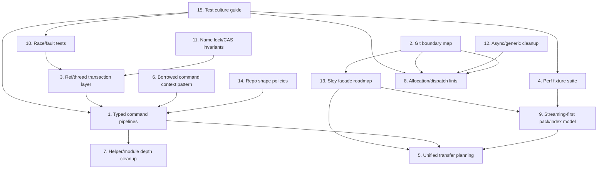

# Heddle Health And Performance Improvement Plan

Status: planning note. These recommendations describe follow-up work suggested
after the first Rust performance safe wave on `codex/fanout-safe-wave`. They
are not shipped behavior unless a later implementation note or changelog entry
says so.

The common theme is to make Heddle faster and easier to reason about by
gathering facts once, keeping ownership and mutation boundaries explicit,
streaming by default, and routing Git-shaped work through Sley instead of
duplicating Git plumbing locally.

## Priority Shape

1. Build stronger typed execution and transaction boundaries before broad
   optimization work.
2. Make architectural boundaries enforceable with lints and fixture tests.
3. Keep performance work measurable, boring, and tied to visible workloads.
4. Prefer deeper local modules that own invariants over shallow helper sprawl.

## Core Work And Dependency DAG

The 15 recommendations group into four core pillars plus supporting lanes. The
pillars should drive planning and staffing. The supporting lanes either make the
core work safer to perform or become more valuable after the core boundaries are
in place.

### Core Pillars

1. Architecture boundaries
   - `2. Git boundary map`
   - `13. Sley facade roadmap`
   - Purpose: decide what belongs in Heddle, what belongs in Sley, and what is
     intentionally test-only or oracle-only.
2. Mutation safety
   - `3. Ref/thread transaction layer`
   - `10. Race and fault testing`
   - `11. Invariant comments near CAS/lock sites`
   - Purpose: protect the correctness spine around refs, HEAD, thread metadata,
     oplog records, undo records, and crash recovery.
3. Command data flow
   - `6. Borrowed command context pattern`
   - `14. Repo shape policies`
   - `1. Typed command execution pipeline`
   - Purpose: gather each command's minimal facts once and pass typed borrowed
     data through compute, render, and verification steps.
4. Measured performance
   - `4. Performance fixture suite`
   - `9. Streaming-first pack/index model`
   - `5. Unified local/hosted transfer planning`
   - Purpose: make performance work empirical, streaming-first, and shared
     across local and hosted transfer paths.

### Supporting Lanes

- `7. Helper/module depth cleanup` should run opportunistically after command
  and policy boundaries are clearer. It is more valuable once it can fold
  helpers into named modules that own real behavior.
- `8. Allocation/dispatch local lints` should follow architecture and dispatch
  allowlists. Lints added too early risk freezing accidental current shapes.
- `12. Async/generic cleanup` can proceed incrementally, but it should avoid
  type explosions and leave framework-required dynamic dispatch alone.
- `15. Preserve and extend the test culture` starts immediately and supports
  every lane.

### DAG



### Parallel Waves

Wave 1 can run in parallel because most tasks are design, test scaffolding, or
small boundary clarification work with limited write overlap:

- `2. Git boundary map`
- `13. Sley facade roadmap`
- `10. Race/fault test expansion`
- `11. Invariant comments`
- `6. Borrowed command context pattern`
- `14. Repo shape policy sketch`
- `4. Performance fixture suite`
- `15. Test culture guide`

Wave 2 should follow once Wave 1 has named the boundaries and given the work
better tests:

- `3. Ref/thread transaction layer`
- `1. Typed command pipelines` for `status`, `snapshot`, and `merge`
- `9. Streaming-first pack/index expansion`
- `12. Async/generic cleanup`

Wave 3 should follow after the architecture has settled enough for cleanup and
lints to enforce the right shape:

- `5. Unified transfer planning`
- `7. Helper/module depth cleanup`
- `8. Allocation/dispatch lints`

### Parallelism Rules

- Run Wave 1 as independent fan-out lanes with explicit ownership by document,
  crate, or command surface.
- Do not start `3. Ref/thread transaction layer` until `10` and `11` have at
  least the first test/comment pass in place.
- Do not start broad `1. Typed command pipelines` until `6` and `14` name the
  target pattern.
- Do not start `5. Unified transfer planning` until `9` and the Sley facade
  roadmap clarify what pack/transfer primitives should be shared.
- Do not enforce `8. Allocation/dispatch lints` until allowlists from `2`,
  `12`, and framework boundaries are explicit.

## 1. Make Command Execution A Typed Pipeline Everywhere

### Current Pressure

Many commands still grow organically around a mix of preflight checks, repo
queries, render preparation, and post-operation verification. That shape makes
it easy for a command to ask for the same fact more than once, especially facts
like current HEAD, current thread, worktree status, Git-overlay status, target
tree, and base tree.

The first safe wave introduced narrow gather structs for `diff` and local sync.
That pattern should become the default command shape where it improves clarity.

### Proposed Direction

Move high-traffic commands toward:

```text
parse args
  -> gather typed facts once
  -> compute command result
  -> render from the result
  -> verify from the same gathered facts or explicit post-state
```

The key is not to create one large universal context object. Each command should
own a small context that names the facts it needs and borrows from the repo or
store where possible.

### Good First Targets

- `status`: current checkout, current thread, Git-overlay state, worktree status,
  and verification state are natural gathered facts.
- `snapshot` and `commit`: identity, current HEAD, worktree status, ignore
  matcher, and post-capture verification should be passed explicitly.
- `merge` and `thread refresh`: source state, target state, merge base, semantic
  eligibility, and dirtiness checks can be named as one command-local plan.
- `remote` and `clone`: endpoint facts, local repo shape, and transport
  capability checks should be gathered once and reused for rendering and
  mutation.
- `log` and `blame`: path filters, history bounds, attribution/provenance needs,
  and commit graph availability should be gathered once.

### Implementation Sketch

- Add command-local structs first, such as `StatusGatherContext<'repo>` or
  `MergeGatherContext<'repo>`.
- Keep fields borrowed where possible: `&Repository`, `&Tree`, `&Path`,
  borrowed config views, and slices over collected path facts.
- Move render functions to accept command result structs instead of re-opening
  the repo or recomputing facts.
- Add tests that detect repeated expensive calls only when there is already a
  local seam, such as status scans or tree/blob reads. Avoid brittle
  implementation-count tests where behavior coverage is enough.

### Verification

- Existing command integration tests for each migrated command.
- JSON output schema tests where rendering changes.
- Focused performance smoke tests only after the new context removes repeated
  work on a realistic fixture.

## 2. Create A Formal Git Boundary Map

### Current Pressure

Heddle has a strong direction: Sley is the Git-format engine, while subprocess
`git` remains valid for tests and conformance oracles. The codebase already has
linting around production Git process spawns, but future contributors need an
explicit inventory of which Git-shaped operations belong where.

### Proposed Direction

Create a checked-in Git boundary map that classifies each Git-shaped operation:

- `Sley-backed`: production code already uses Sley.
- `Sley facade gap`: production code wants a Sley facade before local cleanup.
- `Test oracle`: subprocess Git is intentionally used to assert compatibility.
- `Intentional subprocess`: rare production cases that still earn their keep.

The map should feed the existing git-process lint so drift is caught
mechanically.

### Implementation Sketch

- Add a document under `docs/`, likely next to `docs/SLEY_INTEGRATION.md`.
- Add an allowlist file consumed by `tests/git_process_lint.rs`.
- Require each allowlist entry to carry owner, reason, and desired end state.
- Review all `Command::new("git")` sites whenever the allowlist changes.

### Verification

- `cargo test --test git_process_lint`
- Workspace lint remains green when a Git subprocess is moved, removed, or
  reclassified.

## 3. Deepen The Ref And Thread Transaction Layer

### Current Pressure

Correctness risk clusters around mutable references, HEAD, thread metadata,
reflogs, oplog records, undo records, and crash recovery. The safe wave moved
attached `goto` and ref delete/update flows toward expected-old semantics, but
the broader shape still deserves a named transaction layer.

### Proposed Direction

Introduce one ref/thread transaction API that owns:

- expected-old checks
- locked read-modify-write
- attached HEAD updates
- reflog/oplog ordering
- thread metadata convergence
- undo/redo recovery records
- crash-replay shape

Callers should express intent, not manually interleave ref writes and metadata
updates.

### Implementation Sketch

Start with a small API around operations that already share ordering rules:

```rust
repo.ref_transactions()
    .update_thread(thread_id)
    .expect_old(old_state)
    .set_new(new_state)
    .record_op(op_record)
    .update_attached_head_if_current()
    .commit()?;
```

Do not hide every detail immediately. The first version should reduce the
highest-risk write sequences while keeping tests close to existing behavior.

### Verification

- Race tests for delete vs update, update vs update, and attached HEAD movement.
- Fault-injection tests around record-before-publish and publish-before-metadata
  boundaries.
- Existing undo/redo and thread metadata tests.

## 4. Build A Real Performance Fixture Suite

### Current Pressure

Heddle has many useful performance smoke tests, but performance claims need
stable fixtures that exercise realistic shapes over time. The streaming pack
work showed that an optimization can regress small-pack wall time even when the
architecture is directionally right.

### Proposed Direction

Build a fixture suite with repeatable repo shapes and captured metrics:

- many small files
- few multi-MB and multi-GB-class blobs, scaled by local budget
- deep linear history
- wide branch/ref sets
- heavy rename and move workloads
- Git-overlay import/export workloads
- hosted sync pack transfer workloads
- semantic merge workloads

Track:

- wall time
- peak RSS
- object count
- pack count
- bytes read and written
- syscall counts where cheap to collect
- cold vs warm cache behavior

### Implementation Sketch

- Put fixture definitions under `docs/perf/` and executable harnesses under the
  appropriate crate tests or benches.
- Keep normal `cargo test` smoke tests small.
- Put expensive or flaky environment-dependent runs behind `--ignored`,
  `--release`, or explicit env flags.
- Store baseline JSON output for stable comparisons where useful.

### Verification

- A small default smoke test remains in `cargo test --workspace`.
- Release-mode benchmark jobs run on demand or nightly.
- Each claimed speedup names the fixture and metric that improved.

## 5. Unify Local Sync And Hosted Sync Planning

### Current Pressure

Local sync and hosted sync both decide which states, trees, blobs, sidecars,
visibility records, and redaction records need to move. Today they share some
conceptual logic but do not yet present one common transfer-planning model.

### Proposed Direction

Create a transport-independent transfer planner that computes the minimal
closure needed for a sync operation. Local filesystem copy, hosted gRPC, native
pack transfer, and future Sley-backed pack streaming should execute plans
instead of rediscovering closure rules independently.

### Implementation Sketch

The planner should output typed steps, for example:

```text
TransferPlan
  states
  trees
  blobs
  sidecars
  visibility_records
  redaction_records
  git_overlay_pack_requests
```

Then each transport gets an executor:

- `LocalTransferExecutor`
- `HostedGrpcTransferExecutor`
- `NativePackTransferExecutor`
- future `SleyReachablePackExecutor`

### Verification

- Local sync redaction/provenance transfer tests.
- Hosted sync native-pack tests.
- Round-trip tests that compare two transports on the same source and target
  repo shape.

## 6. Promote Borrowed Command Context As A Repo Pattern

### Current Pressure

The codebase has many places where a helper receives only a repo handle or path
and then re-derives facts its caller already knew. This costs performance and
forces lower-level functions to know too much about command policy.

### Proposed Direction

Use borrowed command contexts as a visible pattern. The important properties:

- small and command-specific
- lifetimes tied to the repository or command invocation
- no hidden mutation
- names facts rather than actions
- cheap to pass through compute and render layers

### Implementation Sketch

Prefer:

```rust
struct StatusFacts<'repo> {
    repo: &'repo Repository,
    head: Option<ContentHash>,
    thread: Option<&'repo ThreadName>,
    worktree: WorktreeStatus,
    git_overlay: Option<GitOverlayStatus>,
}
```

over helpers that repeatedly call `repo.head()`, `repo.current_thread()`,
`git_overlay_worktree_status()`, and status scans.

Do not make one global `CommandContext` unless repeated command-local contexts
prove the common fields are stable.

### Verification

- Command tests remain behaviorally identical.
- Add focused tests for stale or dirty state handling when the context includes
  cached status facts.

## 7. Keep Replacing Shallow Helpers With Modules That Own Behavior

### Current Pressure

Some helpers only rename a call or forward arguments. Others concentrate real
policy and are worth keeping or deepening. Removing helpers blindly would make
the code less readable; keeping all helpers makes control flow harder to follow.

### Proposed Direction

Apply a deletion test:

- If deleting the helper and inlining the call makes the caller clearer, delete
  it.
- If the helper owns an invariant, move that invariant closer to the helper and
  deepen the module.
- If the helper is a facade boundary, make the boundary explicit and document
  what it hides.

### Implementation Sketch

Candidates for review:

- command modules with one-line pass-through wrappers
- facade-adjacent helpers that only translate names
- modules that split one cohesive workflow across many small files

Do not optimize for line count. Optimize for locality: a reader should find the
policy and its tests together.

### Verification

- No behavior-only tests need changing because of helper deletion.
- Code review should check that call stacks became shorter or invariants became
  easier to find.

## 8. Add Allocation And Dispatch Local Lints

### Current Pressure

The review found avoidable boxed dispatch and allocation in a few areas. It is
easy for those patterns to return as the codebase grows, especially where
frameworks like tonic make dynamic dispatch look normal.

### Proposed Direction

Add local lint-style tests for selected hot modules:

- production `async_trait` usage
- `Pin<Box<dyn Stream>>` usage
- production `Box<dyn ...>` seams
- production `Command::new("git")`
- hot-path `.to_string()`, `.to_vec()`, and `collect::<Vec<_>>()`
- eager blob/tree materialization where streaming APIs exist

Each lint should have an allowlist with a reason. Framework-required cases
should be allowed clearly rather than fought.

### Implementation Sketch

- Extend existing lint tests instead of adding a new lint framework at first.
- Scope allocation lints to known hot modules to avoid noisy false positives.
- Require comments in the allowlist that say whether the case is framework
  required, a design seam, or temporary debt.

### Verification

- Lint tests pass in `cargo test --workspace`.
- False positives are documented and do not require awkward production code.

## 9. Make Pack And Index Streaming The Default Mental Model

### Current Pressure

Streaming is now used in more pack-writing paths, but the codebase should treat
bounded-memory streaming as the default for pack, index, sync, import, and
maintenance paths. The safe wave also showed that streaming needs adaptive
thresholds so small workloads are not slowed by unnecessary disk scratch work.

### Proposed Direction

Default to:

- stream bytes through readers/writers
- keep bounded in-memory scratch for small inputs
- spill to disk only past a measured threshold
- preserve object IDs and atomic install semantics
- keep aggressive delta repack on the builder that owns delta behavior until a
  streaming delta builder exists

### Implementation Sketch

- Audit pack/index callers for eager `Vec` construction.
- Add streaming builders where callers only need bytes and index metadata.
- Make thresholds constants with tests that exercise both in-memory and spill
  modes.
- Keep delta compression behavior explicitly separate from default repack.

### Verification

- Object store pack tests.
- GC tests.
- Snapshot/capture performance tests for many small blobs and several large
  blobs.
- Peak RSS benchmark before claiming memory improvement.

## 10. Strengthen Race And Fault Testing Around Ref And Metadata Writes

### Current Pressure

Heddle already has strong concurrency, fault-injection, and formal-spec
coverage. The next layer is more targeted interleavings around refs, HEAD,
thread metadata, oplog records, and undo records.

### Proposed Direction

Add explicit race and crash tests for:

- delete vs update
- attached `goto` vs capture
- thread metadata convergence under concurrent writers
- undo/redo against concurrently moved refs
- crash after operation record write but before ref publish
- crash after ref publish but before metadata convergence

### Implementation Sketch

- Prefer deterministic interleaving tests over stress loops where possible.
- Reuse existing lock and fault-injection seams.
- Keep slow soak tests ignored by default.

### Verification

- Targeted race tests in `crates/refs`, `crates/repo`, and CLI integration
  where user-visible recovery language matters.
- Existing formal specs remain green.

## 11. Name Invariants Near Lock And CAS Sites

### Current Pressure

Some of the most important behavior in Heddle is not obvious from the Rust
types alone. Ordering rules around locks, CAS expectations, oplog records, and
recovery markers are easy to accidentally weaken during cleanup.

### Proposed Direction

Add short comments near non-obvious lock/CAS sites that name the invariant. This
should be rare and concrete, not broad narration.

Useful examples:

- "Record first, publish second, so replay can recover the visible ref move."
- "Expected-old protects delete-after-read from racing with a later update."
- "Metadata convergence is best-effort after the ref publish; the ref remains
  authoritative."

### Implementation Sketch

- Add comments only where the ordering is part of a recovery or concurrency
  contract.
- Prefer comments at the call site that performs the ordered writes.
- Avoid comments that merely restate function names.

### Verification

- Code review should reject comments that describe mechanics without naming an
  invariant.

## 12. Keep Async And Generic Cleanup Incremental

### Current Pressure

The safe wave removed low-risk boxed streams and `async_trait` usage in a few
places. There are likely more opportunities, but forcing generics everywhere can
make APIs harder to read and compile.

### Proposed Direction

Continue replacing boxed dispatch only when:

- there is no real dynamic caller
- the concrete associated type remains readable
- framework constraints do not require boxing
- the change does not create large type signatures that obscure behavior

Tonic and similar service boundaries may keep dynamic dispatch where it earns
its keep.

### Implementation Sketch

- Audit one crate at a time.
- Convert local traits with single or static call sites to RPITIT or generics.
- Leave object-safe traits in place when they encode plugin, runtime, or
  framework seams.
- Document allowed boxed stream sites.

### Verification

- Crate-level `cargo check` for each changed crate.
- Targeted service or pipeline tests.
- `cargo clippy --workspace --all-targets --all-features`.

## 13. Add A Sley Facade Roadmap File

### Current Pressure

Sley is the intended Git engine, and Heddle should not duplicate Git plumbing
when Sley can expose a facade. Some facade needs are known, but they should be
tracked in a way that connects Heddle callers to Sley work.

### Proposed Direction

Create a Sley facade roadmap with one row per desired facade:

- facade name
- Heddle caller
- current workaround
- desired Sley shape
- priority
- tests required
- whether Heddle can consume it through a path patch or released version

Likely facade areas:

- HEAD and symref inspection
- ref and reflog CAS updates
- atomic checkout/index/ref transactions
- typed status rows
- revision graph queries
- ref peeling
- remote config editing
- reachable pack streaming

### Implementation Sketch

- Extend or companion `docs/SLEY_INTEGRATION.md`.
- Keep the roadmap specific enough for Sley issues or PRs.
- Avoid adding Heddle-local wrappers as a substitute for missing Sley APIs unless
  they are thin temporary adapters.

### Verification

- Sley facade parity tests.
- Heddle Git boundary lint updated when a workaround moves to Sley.

## 14. Turn Repo Shape Decisions Into Named Policies

### Current Pressure

Many commands branch on repo shape: native Heddle, Git overlay, plain Git,
bare, materialized thread checkout, hosted target, or lazy hydration boundary.
When these checks are open-coded, behavior can drift between commands.

### Proposed Direction

Introduce small policy APIs or enums that name what a command is allowed to do
in the current repo shape.

For example:

```rust
enum CheckoutCapability {
    NativeHeddle,
    GitOverlay,
    PlainGitReadOnly,
    MaterializedThread,
    BareStore,
}
```

Commands should ask a policy object for capability decisions instead of
recreating the full detection tree.

### Implementation Sketch

- Start with one policy where drift already causes user-facing confusion, such
  as status/verify/commit recommendations.
- Keep policy names user-visible enough to align error messages and recovery
  advice.
- Avoid a giant environment object. Small policy enums are enough at first.

### Verification

- CLI polish tests for recovery text.
- JSON schema tests for machine-readable blockers.
- Existing Git-overlay and native mode integration tests.

## 15. Preserve And Extend The Existing Test Culture

### Current Strength

Heddle already has unusually good coverage: unit tests, CLI integration tests,
conformance tests, formal specs, local lint tests, fault-injection tests, and
performance smoke tests. That is a strength worth preserving.

### Proposed Direction

Make the test culture cheaper to extend:

- document which suite catches which class of regression
- provide templates for new command tests
- keep lint allowlists explainable
- move expensive tests behind clear flags
- keep performance claims tied to fixtures
- keep formal specs near the concurrency invariants they model

### Implementation Sketch

- Add a short "where to test this" guide under `.agents/testing` or `docs/`.
- For each major architectural boundary, name the expected test layer:
  command behavior, object storage, refs, Git bridge, hosted sync, formal spec,
  lint, or benchmark.
- When adding a new command pattern, include one example test that future
  commands can copy.

### Verification

- Contributors can add a feature without guessing which test layer applies.
- New lints and fixtures do not slow normal local development excessively.

## Suggested Order Of Work

1. Add the Git boundary map and Sley facade roadmap, because they guide future
   work without changing behavior.
2. Deepen ref/thread transactions around the highest-risk write paths.
3. Expand typed command pipelines for `status`, `snapshot`, and `merge`.
4. Build the performance fixture suite and use it to guide streaming work.
5. Unify transfer planning once local sync and hosted sync have enough common
   typed vocabulary.
6. Add allocation and dispatch lints only after the intended allowed cases are
   written down.

## Non-Goals

- Do not remove helpers just to reduce helper count.
- Do not replace framework-required dynamic dispatch with unreadable generic
  signatures.
- Do not add Heddle-local Git plumbing when the correct fix is a Sley facade.
- Do not claim a speedup without a fixture, benchmark, or at least a targeted
  smoke test showing the changed workload.
- Do not turn command context into one global bag of optional fields.
