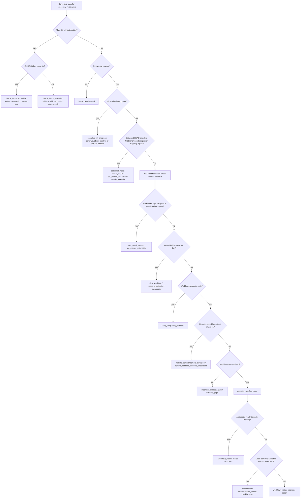

# Heddle Verification State Logic Map

This map documents both the current centralized repository verification
implementation and the intended next model for the OSS CLI. It exists to make
overlapping repository states explicit enough that future changes can prove
which state wins before a command says clean, ready, synced, up to date, or
nothing to do.

Unless a row is labeled **Target**, it describes the current implementation.
Target rows describe the next model and must not be cited as shipped behavior.

## Terminology

- `RepositoryVerificationState` is the canonical proof surface. `heddle verify
  --output json` emits it directly when clean; `status`, `diagnose`,
  `thread list/show`, many
  post-operation envelopes, and mutating command preflights embed or defer to
  the same shape. `import git` and `fsck --repair git` post-operation
  JSON do not yet embed this proof; embedding it there is target behavior.
- Repository capability terms are `plain-git`, `git-overlay`, and
  `native-heddle`. Human labels such as `Git + Heddle` or `Git + Heddle
  isolated checkout` describe the operator context; they are not new state
  machines. Use `CONTEXT.md` as the glossary for Git Overlay, Git Projection Mapping,
  Git Checkpoint, Repository Verification State, and Machine-Contract Proof. Use
  Bridge Mirror only when describing legacy mirror migration or repair.
- In Git-overlay mode, active Git reads and writes use the checkout's real
  `.git`. Heddle stores Git Projection Mapping metadata under
  `.heddle/git-projection/` and uses legacy Bridge Mirror data only as
  migration or repair input when present.
- `verified: true` means repository safety checks are clean. It does not mean
  there is no useful workflow action. Ready threads and local commits waiting to
  push can keep repository verification clean while setting a next action.
- `workflow_status` is separate from `status`. Ready work changes workflow
  guidance; it does not disverify an otherwise clean checkout.
- `recommended_action` is human display text. `recommended_action_template` is
  the canonical machine-readable form: `argv_template` is the executable argv
  (always present for a valid action), and `required_inputs`/`agent_may_fill`
  describe placeholders such as a commit message or thread name. When
  `agent_may_fill` is false, treat `action` and `argv_template` as
  display-only: do not substitute `<name>`/`<url>` placeholders. Surface the
  template to a human or discard it; substituting and running it will pass
  literal `<name>` to Heddle and fail. (The always-null `recommended_action_argv`
  sidecar was dropped - see HeddleCo/heddle#254.)

## Verification State Dimensions

A clean verification report means all applicable dimensions agree:

| Dimension | Clean proof | Blocking or non-clean states |
|---|---|---|
| Repository mode | Native Heddle, initialized Git overlay, Heddle-managed isolated checkout, or observe-only plain Git probe is classified. Isolated checkouts report clean local verification because Git verification belongs to the parent checkout. | `needs_init`, `no_commits`, `degraded`, unsupported checkout shape. |
| Git/Heddle import and head mapping | The active Git branch tip is imported and the current branch maps to an imported Heddle state. | `detached_head`, `needs_import`, `git_branch_advanced`, `needs_reconcile`, unmapped active Git history. |
| Side-branch and tag import | Missing non-active Git branch tips are reported as `available` import work and do not block the active checkout. Tags visible to the checkout map to Heddle markers. | `tags_need_import`, `tag_marker_mismatch`; `available` is informational. |
| Worktree | Git index/worktree and Heddle worktree compare cleanly. Native Heddle worktrees compare cleanly against the current state. | `dirty_worktree`, `needs_checkpoint`, native `uncaptured`, or worktree inspection `degraded`. |
| Remote tracking | No upstream work must be integrated before local mutation. `remote_ahead` and `remote_untracked` are verified-clean publish guidance. | `remote_behind`, `remote_diverged`, `remote_contains_undone_checkpoint`, or remote check `degraded`. |
| Operation | No Git or Heddle operation is in progress. | Rebase, cherry-pick, merge, bisect, or Git projection operation needs continue, abort, resolve, or raw-Git handoff. |
| Workflow | Ready work is reported as workflow guidance after repository safety is known, and merged-thread metadata agrees with target history. | `workflow_status: blocked` when ready work exists but a repository blocker prevents landing; `stale_integration_metadata` when merged-thread records no longer match target history. |
| Machine contract | Command catalog, JSON error envelopes, op-id metadata, schema introspection, docs drift, and schema coverage agree. `available_with_doc_gaps` is currently non-blocking. | `machine_contract_gaps` / `schema_gaps`, command contract drift, schema validation failures. |
| Generated and ignored artifacts | Heddle auto-ignores only its own `.heddle/` metadata. Everything else is ignored only when the repo explicitly says so. In Git-overlay mode, `.gitignore` is the preferred source of ignored-worktree truth; `.heddleignore` is reserved for Heddle-specific or native-Heddle excludes. | Unignored generated output is ordinary worktree dirt; large captures/deletions require explicit force; redaction/purge flows must name the ignore file that Heddle will actually consult. |
| Persona/output contract | TTY text is human-facing, piped/explicit JSON is machine-facing, and both carry the same next action semantics. | Prose on JSON stdout, missing error envelopes, stale help/schema metadata, narrow/no-color output that hides the action. |
| Clone/adoption | Git checkout and Heddle mapping agree after clone/adoption. | Clone verification blocked by any verification blocker above. |

## Precedence

Verification is fail-closed for hard blockers. The first hard blocker below
controls the top-level `status`, `recommended_action`, and
`recovery_commands`. Non-blocking workflow and publish guidance are selected
only after repository safety is clean.

Once repository health is clean, the implementation chooses top-level actions
in this order: machine-contract repair, verified workflow guidance, then remote
publish guidance (`remote_ahead` or `remote_untracked`). That keeps proof
repair and ready work from being hidden by `heddle push`.

## Command Gates

| Command family | Gate |
|---|---|
| Observe-only commands | `status`, strict `verify`, `doctor`, `thread list/show`, `log`, `show`, `diff`, `help`, and `schemas` may probe plain Git, but must not create `.heddle`, write refs, or change `git status --short`. Blocked `verify` exits nonzero and carries the proof in the JSON error envelope. |
| First-run adoption | `adopt` is the guided path that initializes Heddle, imports Git branch tips, and returns post-adoption verification. Plain Git with one active branch recommends `heddle adopt --ref <branch>`; multi-ref repos may recommend `heddle adopt`; unborn Git recommends `heddle init`. `init` leaves project files untouched, may protect only Heddle metadata with local Git excludes in Git-overlay mode, does not install `.heddleignore`, does not add broad generated-noise patterns, and exposes `needs_import` until adoption/import completes. |
| Active branch import | Mutating commands that could capture, checkpoint, move refs, materialize work, or claim up-to-date must refuse while the active Git branch needs import or mapping repair. |
| Side-branch import | Missing side-branch tips are surfaced as available import work, but do not make the current checkout unverified and must not replace the active repair action. |
| Tag import and marker agreement | Git tags visible to the checkout must map to Heddle markers. Missing markers report `tags_need_import`; disagreeing or unmapped markers report `tag_marker_mismatch`. Both are current hard blockers because tag names are user-facing refs, not optional side-branch hints. |
| Dirty materialization | `switch`, `switch`, `pull`, `thread drop`, `thread promote`, `start --path`, `merge`, `rebase`, `cherry-pick`, and `undo` must refuse dirty work unless a command has an explicit safe preview or force path. |
| Commit/checkpoint | Git-compatible `commit` is one logical operation: capture Heddle state, checkpoint Git, return one verification proof, and make one safe `undo` restore both when possible. A commit may not create a Heddle-only state if Git checkpoint preflight is blocked by remote divergence or import repair. |
| Ready/land | `ready` preflights active-branch import before auto-capture and then points to `land`. `merge --preview` remains an advanced non-mutating proof surface, but it is not the everyday breadcrumb. Ready workflow guidance takes priority over local-ahead or untracked-branch push guidance. |
| Resolve | `resolve` and `thread resolve` must distinguish no operation, no conflicts, conflict resolution, and thread-review resolution. No-op resolve failures use typed errors and should point back to `status` rather than leaking object lookup internals. |
| Undo | `undo --preview` and real `undo` share safety refusals. Both refuse dirty worktree and active-operation states before moving refs or worktree bytes. Post-undo text must report the current verification state and next action instead of claiming clean by default. |
| Remote push/pull | Transfer commands refresh tracking and return post-transfer verification. `remote_ahead` and `remote_untracked` are verified clean publish guidance and recommend `push`; behind and diverged states are blockers. If upstream still points at the exact Git checkpoint just undone locally, verification reports `remote_contains_undone_checkpoint` and recommends `heddle push --force` with `heddle undo --redo` as the restore-work option, never `heddle pull` as the primary action. A command may not claim synced while blocking remote drift remains. |
| Integrated remote divergence | If a diverged upstream has been fetched, imported, and merged into the current Heddle state, `needs_checkpoint` becomes the primary blocker even while Git tracking still reports divergence. `checkpoint` is allowed in exactly that integrated state because it is the operation that writes the Git merge checkpoint and turns the remaining state into ordinary `heddle push` work. |
| Git projection import/repair JSON (**Target**) | `import git` and `fsck --repair git` success JSON do not yet embed the post-operation `RepositoryVerificationState` — the `verification` field is `#[serde(skip_serializing)]` on those envelopes, so it is omitted from `--output json`. Agents still need a follow-up `verify` call to know whether the operation left the repository verified or still blocked. Embedding the proof inline (alongside recommended action and recovery command metadata) is target behavior. |
| Generated artifact safety | `status`, `capture`, `commit`, and `merge` must respect explicit ignore rules, keep explicitly ignored changes from becoming fake work, and surface unignored generated/vendor/dist/build paths as ordinary dirty work or heavy-impact work when captured. Git-overlay mode prefers `.gitignore` for shared ignore policy so raw `git status --short` and Heddle agree by construction; `.heddleignore` remains available for Heddle-only excludes. Heddle must not install or assume default generated-noise patterns beyond `.heddle/`. Large captures and deletions require explicit force. |
| JSON and op-id | Runtime command surfaces, command catalog output, schemas, JSON envelopes, and op-id support are derived from the command contract table. No current command advertises generated-resume op-id persistence; agents that need replay must supply an explicit id only to commands with `supports_op_id: true`. |
| Persona-driven UX | Human text answers what happened, current state, and next step. Agent/script JSON keeps stdout parseable, stderr reserved for error envelopes, and action metadata executable or explicitly templated. Support/maintainer diagnostics live in `doctor`, and verbose/version surfaces. |

## Proof Matrix

These tests and cold-flow scripts are the current executable proof points for
the map. When a state is added or reordered, extend the matrix before verifying
the new behavior.

| State or gate | Proof |
|---|---|
| Plain Git observe-only probes do not initialize Heddle | `git_overlay_matrix_observe_only_contract_preserves_plain_git_repo`; `git_process_lint`; `git_replacement_matrix` observe-only coverage |
| Plain Git first-run guidance is explicit | `git_overlay_matrix_plain_git_no_commit_bootstrap_commands`; `git_overlay_matrix_plain_git_with_branches_and_tags_recommends_adopt_all`; `git_overlay_matrix_verify_tracks_plain_init_import_clean_loop` |
| `init` leaves Git status clean and import remains visible | `git_overlay_matrix_init_in_git_repo_keeps_git_status_clean`; `git_overlay_matrix_verify_tracks_plain_init_import_clean_loop`; init JSON contract coverage |
| Guided adoption reaches clean verification | `git_overlay_matrix_adopt_initializes_imports_and_verifies`; `scripts/verify-cold-flow-human.sh`; `scripts/verify-cold-flow-agent.sh` |
| Isolated checkout context is identified without raw Git leakage | `git_overlay_isolated_checkout_status_and_verify_identify_parent_context`; `test_status_text_in_isolated_checkout_does_not_leak_raw_git_stderr` |
| Active-branch import blocks mutating readiness | `git_overlay_matrix_ready_blocks_when_repository_verification_needs_import`; `git_overlay_matrix_commit_noop_fails_closed_when_verification_blocked` |
| Side-branch import hints are informational | `git_overlay_matrix_auto_adopts_local_branch_tips_without_full_import`; `git_overlay_matrix_reopen_from_different_cwds_preserves_state_and_git_only_aliases`; `git_overlay_matrix_side_only_import_is_available_not_next_action` |
| Imported branch drift reappears as import work | `git_overlay_matrix_imported_branch_evolution_after_bridge_import`; `git_overlay_matrix_imported_branch_git_only_advance_reappears_in_import_hint`; `git_overlay_matrix_imported_branch_merge_commit_drift_reappears_in_hint` |
| Out-of-band advancement reports its commit count and reconciles round-trip | `git_overlay_matrix_manual_git_commit_after_bootstrap_commands`; `git_overlay_matrix_manual_git_commits_reconcile_round_trip` |
| Detached HEAD blocks Git-overlay mutation | `git_overlay_matrix_detached_head_sequence_commands`; `git_overlay_matrix_commit_refuses_detached_head_without_advancing_branch` |
| Tag import and marker disagreement block verification | `git_overlay_matrix_verify_reports_git_tags_created_after_adoption`; `git_overlay_matrix_verify_reports_moved_git_tag_before_adoption`; `git_overlay_matrix_selective_branch_adopt_surfaces_remaining_tag_import` |
| Dirty worktree paths block unsafe movement | `git_overlay_matrix_dirty_branch_switch_when_git_allows_carryover`; `git_overlay_matrix_subdirectory_dirty_commands`; `git_overlay_matrix_undo_preview_refuses_dirty_worktree_like_real_undo` |
| Native uncaptured work is not reported as clean | `status_reports_uncaptured_for_freshly_initialized_repo`; `checkpoint_refuses_uncaptured_worktree_with_shared_advice`; `merge_preview_blocks_uncaptured_isolated_source_checkout` |
| Commit and undo are one user-visible logical loop | `git_overlay_matrix_undo_rewinds_git_checkpoint_when_safe`; `git_overlay_matrix_unsafe_commit_undo_reports_git_oid_and_preserves_heddle`; `git_overlay_matrix_undo_text_reports_non_clean_post_verify_next_action` |
| Pushed undo keeps intent explicit | `git_overlay_matrix_undo_after_push_recommends_publish_undo_not_pull` |
| Remote drift closes after push/pull | `git_overlay_matrix_bridge_push_pull_report_verification_state`; `git_overlay_matrix_top_level_push_closes_remote_verification_loop`; `git_overlay_matrix_commit_refuses_remote_divergence_before_capture`; `git_overlay_matrix_checkpoint_closes_imported_remote_divergence_after_merge` |
| Git projection import/export/sync/repair run without git on PATH (schema-covered) | `git_replacement_matrix` no-git projection coverage; `target/debug/heddle doctor schemas --output json` |
| Remote publish state is guidance, not disverification | `git_overlay_matrix_top_level_push_closes_remote_verification_loop`; `git_overlay_matrix_local_only_branch_is_clean_until_push_sets_tracking`; `git_overlay_matrix_remote_add_configures_default_push_remote` |
| Remote undone checkpoint remains explicit | `git_overlay_matrix_undo_after_push_recommends_publish_undo_not_pull` |
| No command claims up to date while verification is blocked | `git_overlay_matrix_local_ahead_noop_merge_preserves_merge_relation`; `git_overlay_matrix_rebase_noop_defers_up_to_date_claim_to_verification` |
| Operation continue/abort advice is consistent | `git_overlay_matrix_in_progress_operations_surface_consistently`; `git_overlay_matrix_continue_and_abort_unify_operator_flow`; `git_overlay_matrix_operator_states_survive_reopen_and_keep_guidance_consistent`; `git_overlay_matrix_continue_retry_loops_block_then_succeed_after_resolution` |
| Stale integration metadata blocks workflow verification | `git_overlay_matrix_ship_undo_restores_git_and_heddle_together` |
| Ready/land/resolve/undo workflow is explicit | `start_merge_undo_json_workflow_keeps_machine_streams_clean`; `ready_text_names_ready_and_already_ready_noop_states`; `resolve_without_merge_emits_actionable_json_error`; `git_overlay_matrix_undo_preview_refuses_active_operation_like_real_undo` |
| Generated and ignored artifacts are safe | `git_overlay_matrix_commit_ignores_gitignored_noise_and_refuses_noop`; `git_overlay_matrix_commit_requires_explicit_ignore_for_python_generated_noise`; `git_overlay_matrix_init_excludes_only_heddle_metadata`; `test_cli_capture_blocks_large_git_overlay_deletion_without_force`; `.heddleignore` file-operation tests |
| Persona/output contracts stay coherent | `piped_status_with_no_output_flag_renders_text`; `output_auto_flag_errors_at_parse_with_helpful_message`; `tty_auto_mode_renders_text_and_explicit_json_stays_json`; `quiet_no_color_and_narrow_text_outputs_preserve_global_contract`; `narrow_no_color_text_outputs_cover_everyday_read_surfaces` |
| Machine contracts stay single-sourced | `op_id_coverage`; `doctor_schemas_reports_runtime_and_documented_coverage`; `public_command_paths_have_command_contract_metadata`; `target/debug/heddle doctor schemas --output json`; `target/debug/heddle doctor docs --all --output json` |

## Useful Invariants

- `verified: true` implies no known Git/Heddle disagreement, no dirty Git or
  Heddle worktree, no active operation, no blocking remote drift, no unimported
  active branch, and available machine contracts.
- `remote_ahead` and `remote_untracked` are not blocking remote drift. They keep
  `verified: true` and can set `recommended_action: heddle push`.
- Machine-contract repair and ready workflow guidance outrank publish guidance.
- Ready threads are workflow guidance, not repository disverification. They keep
  `verified: true` and `status: clean`, while `workflow_status: ready` and the
  recommended action points to land the waiting work.
- `import.status: available` is an informational side-branch hint. It must not
  block verification for the active checkout.
- Out-of-band Git movement is reconciled explicitly, never implicitly. When the
  active Git branch advances outside Heddle (`git_branch_advanced`), the report
  states how far it moved ("N out-of-band git commits detected", with an
  `out_of_band_commit_count` detail) and the recovery is the one-line manual
  `heddle adopt --ref <branch>`. Auto-reconcile-on-read is deliberately not
  implemented: observe-only read paths (`status`, `verify`, `doctor`,
  `status`) must not mutate repository state, and the explicit
  adoption/repair step keeps an auditable record of when external Git history entered
  Heddle. Decision recorded 2026-06-12 (HeddleCo/heddle#534).
- Every concrete `recommended_action` emitted by verification must parse through
  the command catalog. Display-only placeholders must carry explicit template or
  argv metadata so machines can distinguish them from runnable commands.
- Every refusal must say what is unsafe, what would be changed or lost, what was
  preserved, and one primary command.
- Preview modes that exist for safety (`merge --preview`, `undo --preview`,
  reconcile preview, cleanup dry-runs) must prove they do not move refs, write
  worktree bytes, or mutate the Git index.
- Text and JSON can differ in presentation, but they must not disagree about the
  primary state, blocker, or next action.

## Open State Questions

- Remote divergence currently chooses between importing the upstream ref and
  previewing a merge when an upstream thread exists. The map does not yet have a
  formal proof that every diverged topology picks the least surprising recovery
  path.
- Generated artifact handling is split between explicit ignore rules,
  generated-path impact classification, large-capture safety, and redaction
  hints. The intended model is now simple: only `.heddle/` is auto-ignored;
  every other ignored path must be named by `.gitignore` or `.heddleignore`.
- Persona-driven UX is enforced by CLI regression tests and command-contract
  metadata, not a formal specification. The strongest proof remains docs/schema
  drift plus text/JSON integration coverage.
- Cross-worktree undo and remote-affecting undo remain intentionally limited.
  They should not be modeled as available recovery paths until the undo design
  document and implementation move them out of follow-up status.
