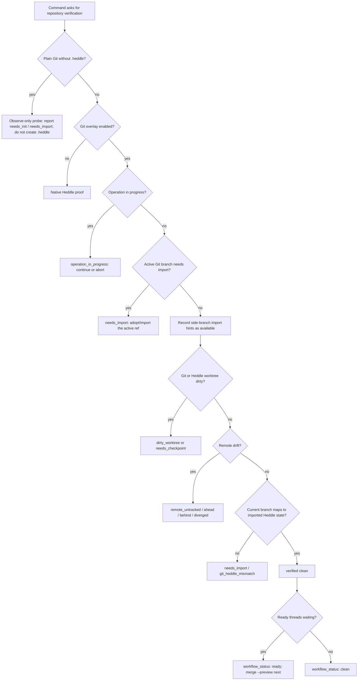

# Heddle Verification State Logic Map

This map documents the shipped Git-overlay verification contract. It exists to make
overlapping repository states explicit enough that future changes can prove
which state wins before a command says clean, ready, synced, up to date, or
nothing to do.

## Verification State Dimensions

`RepositoryVerificationState` is the shared proof surface for `status`, `doctor`,
`diagnose`, `bridge git status`, `verify`, and mutating command preflights. A
clean verification report means all of these dimensions agree:

| Dimension | Clean proof | Blocking states |
|---|---|---|
| Repository mode | Native Heddle or initialized Git overlay is identified. | Plain Git needs Heddle initialization; degraded repository inspection. |
| Git/Heddle import | The active Git branch tip is imported and mapped. | Active branch needs import; current branch points at unmapped Git history. |
| Side-branch import | Missing non-active Git branch tips are reported as available. | Not a verification blocker unless the active branch is missing. |
| Worktree | Git index/worktree and Heddle worktree compare cleanly. | Dirty Git worktree; dirty Heddle worktree; captured Heddle state not checkpointed to Git. |
| Remote | No unresolved upstream drift. | No upstream, ahead, behind, or diverged from upstream. |
| Operation | No Git or Heddle operation is in progress. | Rebase, cherry-pick, merge, or bridge operation needs continue or abort. |
| Workflow | Ready work is reported separately as workflow guidance. | Ready threads do not block repository verification; they only change the recommended workflow action. |
| Machine contract | Command catalog, JSON error envelopes, op-id metadata, and schema introspection are available; schema coverage is reported by `doctor schemas`. | Contract drift or schema/doc failures in validation. |
| Clone | Git checkout and Heddle mapping agree after clone/adoption. | Clone verification blocked by any verification blocker above. |

## Precedence

Verification is fail-closed. The first hard blocker below controls the top-level
`status`, `recommended_action`, and `recovery_commands`.

## Command Gates

| Command family | Gate |
|---|---|
| Observe-only commands | `status`, `diagnose`, `doctor`, `bridge git status`, `thread list/show`, `workspace show`, `log`, `show`, and `diff` may probe plain Git, but must not create `.heddle`, write refs, or change `git status --short`. |
| First-run adoption | `adopt` is the guided path that initializes Heddle, imports Git branch tips, and returns post-adoption verification. `init` in Git leaves `git status --short` clean and exposes `needs_import` until import completes. |
| Active branch import | Mutating commands that could capture, checkpoint, move refs, materialize work, or claim up-to-date must refuse while the active Git branch needs import. |
| Side-branch import | Missing side-branch tips are surfaced as available import work, but do not make the current checkout unverified. |
| Dirty materialization | `switch`, `checkout`, `goto`, `pull`, `thread drop`, `branch -d/-D`, `thread promote`, `start --path`, `merge`, `rebase`, `cherry-pick`, and `undo` must refuse dirty work unless a command has an explicit safe preview or force path. |
| Commit | Git-compatible `commit` is one logical operation: capture Heddle state, checkpoint Git, return one verification proof, and make one safe `undo` restore both. |
| Ready | `ready` preflights active-branch import before any auto-capture. Ready-thread workflow guidance must not make an otherwise clean repository unverified; it should point to the matching `merge --preview` or ship action. |
| Remote push/pull | Transfer commands refresh tracking and return post-transfer verification. A command may not claim synced while remote drift remains. |
| JSON and op-id | Runtime command surfaces, command catalog output, schemas, JSON envelopes, and op-id support are derived from the command contract table. |

## Proof Matrix

These tests and cold-flow scripts are the current executable proof points for
the map. When a state is added or reordered, extend the matrix before verificationing
the new behavior.

| State or gate | Proof |
|---|---|
| Plain Git observe-only probes do not initialize Heddle | `git_overlay_matrix_observe_only_contract_preserves_plain_git_repo`; `git_process_lint` |
| Plain Git first-run guidance is explicit | `git_overlay_matrix_plain_git_no_commit_bootstrap_commands`; `git_overlay_matrix_verification_tracks_plain_init_import_clean_loop` |
| `init` leaves Git status clean and import remains visible | `git_overlay_matrix_init_in_git_repo_keeps_git_status_clean`; `git_overlay_matrix_verification_tracks_plain_init_import_clean_loop` |
| Guided adoption reaches clean verification | `git_overlay_matrix_adopt_initializes_imports_and_verifications`; `scripts/verify-cold-flow-human.sh`; `scripts/verify-cold-flow-agent.sh` |
| Active-branch import blocks mutating readiness | `git_overlay_matrix_ready_blocks_when_repository_verification_needs_import`; `git_overlay_matrix_commit_noop_fails_closed_when_verification_blocked` |
| Side-branch import hints are informational | `git_overlay_matrix_auto_adopts_local_branch_tips_without_full_import`; `git_overlay_matrix_reopen_from_different_cwds_preserves_state_and_hints` |
| Imported branch drift reappears as import work | `git_overlay_matrix_imported_branch_evolution_after_bridge_import`; `git_overlay_matrix_imported_branch_git_only_advance_reappears_in_import_hint`; `git_overlay_matrix_imported_branch_merge_commit_drift_reappears_in_hint` |
| Dirty worktree paths block unsafe movement | `git_overlay_matrix_dirty_branch_switch_when_git_allows_carryover`; `git_overlay_matrix_subdirectory_dirty_commands` |
| Commit and undo are one user-visible logical loop | `git_overlay_matrix_undo_rewinds_git_checkpoint_when_safe`; `git_overlay_matrix_unsafe_commit_undo_reports_git_oid_and_preserves_heddle` |
| Remote drift closes after push/pull | `git_overlay_matrix_bridge_push_pull_report_verification_state`; `git_overlay_matrix_top_level_push_closes_remote_verification_loop`; `git_overlay_matrix_remote_without_upstream_is_not_verified_until_push_sets_tracking` |
| No command claims up to date while verification is blocked | `git_overlay_matrix_blocked_noop_merge_preserves_semantic_result`; `git_overlay_matrix_rebase_noop_defers_up_to_date_claim_to_verification` |
| Operation continue/abort advice is consistent | `git_overlay_matrix_in_progress_operations_surface_consistently`; `git_overlay_matrix_continue_and_abort_unify_operator_flow`; `git_overlay_matrix_operator_states_survive_reopen_and_keep_guidance_consistent` |
| Machine contracts stay single-sourced | `op_id_coverage`; `target/debug/heddle doctor schemas --output json`; `target/debug/heddle doctor docs --all --output json` |

## Useful Invariants

- `verified: true` implies no known Git/Heddle disagreement, no dirty Git or
  Heddle worktree, no active operation, no unresolved remote drift, no
  unimported active branch, and available machine contracts.
- Ready threads are workflow guidance, not repository disverification. They keep
  `verified: true` and `status: clean`, while `workflow_status: ready` and the
  recommended action point to preview or ship the waiting work.
- `import.status: available` is an informational side-branch hint. It must not
  block verification for the active checkout.
- Every concrete `recommended_action` emitted by verification must parse through
  the command catalog. Display-only placeholders must carry explicit template or
  argv metadata so machines can distinguish them from runnable commands.
- Every refusal must say what is unsafe, what would be changed or lost, what was
  preserved, and one primary command.
